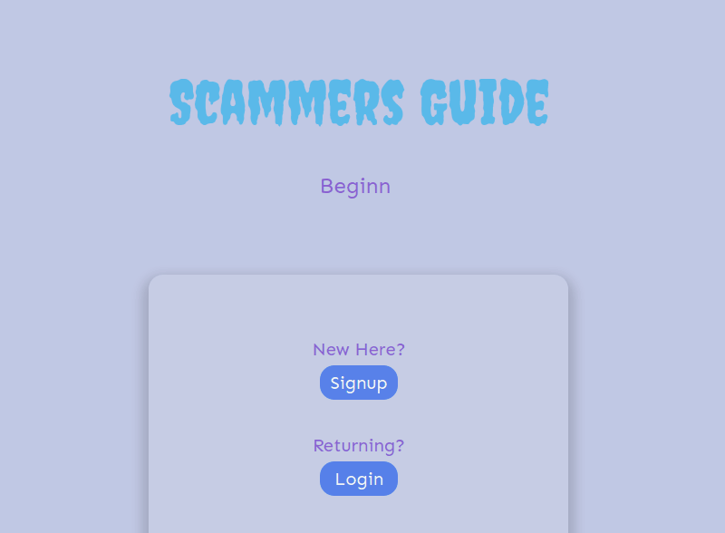

# `Scammers Guide`

A Beginner Investor Web Application that allows users to search stocks and receive relevant information needed to make decisions on whether a stock is worth investing into.

## DEMO

`5` Verify that model looks like the following code snippet ( [here](https://github.com/romebell/express_authentication/blob/main/solutions.md#1-userjs) )

## Technologies and Tools Used 

* Sequelize user model / migration
* Passport and passport-local for authentication
* Sessions to keep user logged in between pages
* Flash messages for errors and successes
* Passwords that are hashed with BCrypt
* Node.js and Express.js
* EJS Templating and EJS Layouts
* JavaScript
* HTML 
* CSS

### User Model

| Column Name | Data Type | Notes |
| --------------- | ------------- | ------------------------------ |
| id | Integer | Serial Primary Key, Auto-generated |
| name | String | Must be provided |
| email | String | Must be unique / used for login |
| password | String | Stored as a hash |
| createdAt | Date | Auto-generated |
| updatedAt | Date | Auto-generated |

### Default Routes

| Method | Path | Location | Purpose |
| ------ | ---------------- | -------------- | ------------------- |
| GET | / | server.js | Home page |
| GET | /auth/login | auth.js | Login form |
| GET | /auth/signup | auth.js | Signup form |
| POST | /auth/login | auth.js | Login user |
| POST | /auth/signup | auth.js | Creates User |
| GET | /auth/logout | auth.js | Removes session info |
| GET | /profile | server.js | Regular User Profile |

`5` Verify that model looks like the following code snippet ( [here](https://github.com/romebell/express_authentication/blob/main/solutions.md#1-userjs) )

